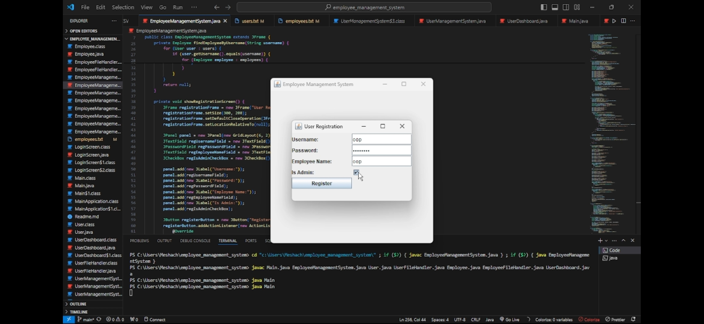

# Employee Management System

This Java Swing application is designed to manage employees and users, with functionalities for user registration, login, and administration by authorized personnel. The system ensures that only admin users can add new employees or users.


# Algorithm for Employee Management System

## 1. Initialize System
- Read employee data from `employees.txt` into `employees` list.
- Read user data from `users.txt` into `users` list.
- Set up the main application window.
- Display the registration screen.

## 2. Show Registration Screen
- Create and display a JFrame for user registration.
- Include fields for:
  - Username
  - Password
  - Employee name
  - Admin status
- On registration button click:
  - Collect user input.
  - Create a new `User` object with the input data.
  - Add the new user to the `users` list.
  - Write updated `users` list to `users.txt`.
  - Show success message.
  - Close registration window.
  - Show login screen.

## 3. Show Login Screen
- Create and display a JFrame for user login.
- Include fields for:
  - Username
  - Password
- On login button click:
  - Collect user input.
  - Call `authenticateUser` method with the input data.
  - If authentication is successful:
    - Show success message.
    - Close login window.
    - If user is admin, initialize admin UI.
    - If user is not admin, find the corresponding employee and show user dashboard.
  - If authentication fails:
    - Show error message.

## 4. Authenticate User
- Loop through the `users` list to find a matching username and password.
- If match is found:
  - Return the corresponding `User` object.
- If no match is found:
  - Return null.

## 5. Initialize Admin UI
- Clear the main window.
- Set up fields for:
  - Employee ID
  - Employee name
  - Position
  - Salary
- Set up fields for adding users:
  - Username
  - Password
  - Admin status
  - Employee name
- Add buttons for:
  - Adding employees
  - Adding users
  - Viewing users
- On add employee button click:
  - Call `addEmployee` method.
- On add user button click:
  - Call `addUser` method.
- On view users button click:
  - Call `viewUsers` method.

## 6. Add Employee
- Collect input data for:
  - Employee ID
  - Employee name
  - Position
  - Salary
- Validate the input data.
- Create a new `Employee` object with the input data.
- Add the new employee to the `employees` list.
- Write the updated `employees` list to `employees.txt`.
- Show success message.
- Clear employee input fields.

## 7. Add User
- Collect input data for:
  - Username
  - Password
  - Admin status
  - Employee name
- Create a new `User` object with the input data.
- Add the new user to the `users` list.
- Write the updated `users` list to `users.txt`.
- Show success message.
- Clear user input fields.

## 8. View Users
- Create a `StringBuilder` to accumulate user data.
- Loop through the `users` list and append each user's data to the `StringBuilder`.
- Set the text of the `displayArea` to the accumulated user data.

## 9. Clear Employee Fields
- Set the text of employee input fields to empty:
  - Employee ID
  - Employee name
  - Position
  - Salary

## 10. Clear User Fields
- Set the text of user input fields to empty:
  - Username
  - Password
- Uncheck the admin status checkbox.

## 11. Main Method
- Launch the Employee Management System application using `SwingUtilities`.

```java
public static void main(String[] args) {
    SwingUtilities.invokeLater(new Runnable() {
        @Override
        public void run() {
            new EmployeeManagementSystem().setVisible(true);
        }
    });
}
```

## Features

1. **User Registration**
   - Users can register with a username, password, and employee name.
   - Admin privilege can be assigned during registration.

2. **User Login**
   - Users can log in with their credentials.
   - Admin users are redirected to the admin interface.
   - Regular users are redirected to their dashboard.

3. **Admin Interface**
   - Admin users can add new employees.
   - Admin users can add new users with admin or regular privileges.
   - Admin users can view all registered users.

4. **File Handling**
   - User details are saved in `users.txt`.
   - Employee details are saved in `employees.txt`.

## Classes and Methods

### Main Class: EmployeeManagementSystem

- **Constructor**
  - Initializes the list of employees and users.
  - Sets up the main window of the application.
  - Displays the registration screen first.

- **Private Methods**
  - `findEmployeeByUsername(String username)`: Finds an employee by username.
  - `showRegistrationScreen()`: Displays the user registration screen.
  - `showLoginScreen()`: Displays the user login screen.
  - `authenticateUser(String username, String password)`: Authenticates a user by username and password.
  - `initializeAdminUI()`: Sets up the admin interface.
  - `addEmployee()`: Adds a new employee.
  - `addUser()`: Adds a new user.
  - `viewUsers()`: Displays the list of registered users.
  - `clearEmployeeFields()`: Clears the employee input fields.
  - `clearUserFields()`: Clears the user input fields.

### Additional Classes

- **User**
  - Represents a user in the system.
  - Contains fields for username, password, admin status, and employee name.
  - Includes getter and setter methods.

- **Employee**
  - Represents an employee in the system.
  - Contains fields for ID, name, position, and salary.
  - Includes getter and setter methods.

- **UserFileHandler**
  - Reads and writes user data to and from `users.txt`.

- **EmployeeFileHandler**
  - Reads and writes employee data to and from `employees.txt`.

## Usage

1. **Running the Application**
   - Compile and run the `EmployeeManagementSystem` class.

2. **Registering a User**
   - The registration screen will be displayed upon running the application.
   - Enter the required details and click the "Register" button.
   - The user details will be saved in `users.txt`.

3. **Logging In**
   - After registration, the login screen will be displayed.
   - Enter your username and password.
   - If the credentials are valid, you will be redirected to the appropriate interface based on your admin status.

4. **Admin Interface**
   - If logged in as an admin, you can add employees and users.
   - View the list of all registered users.

## File Structure

- **users.txt**
  - Contains the list of registered users.

- **employees.txt**
  - Contains the list of employees.



